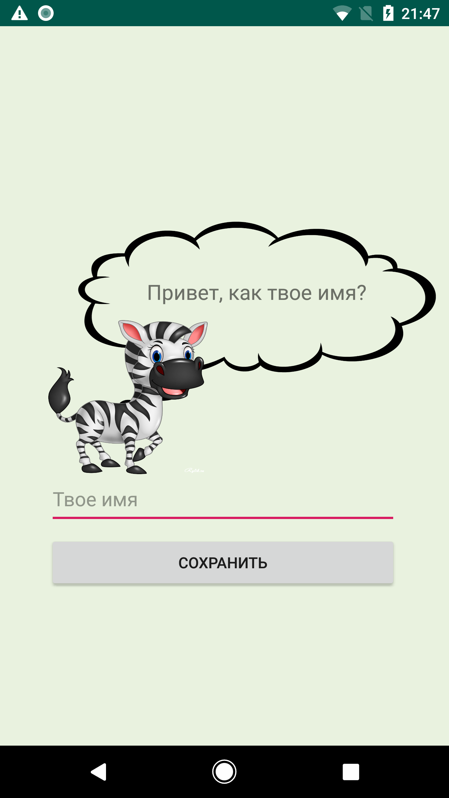
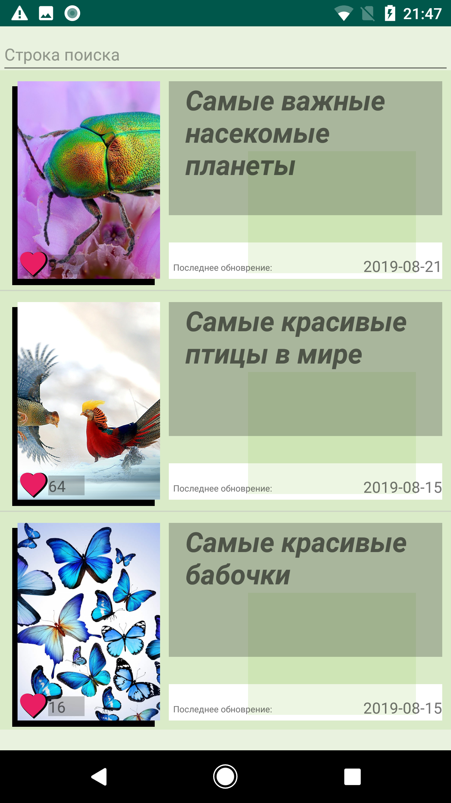
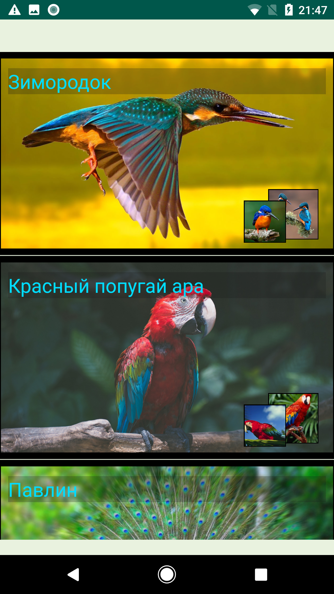
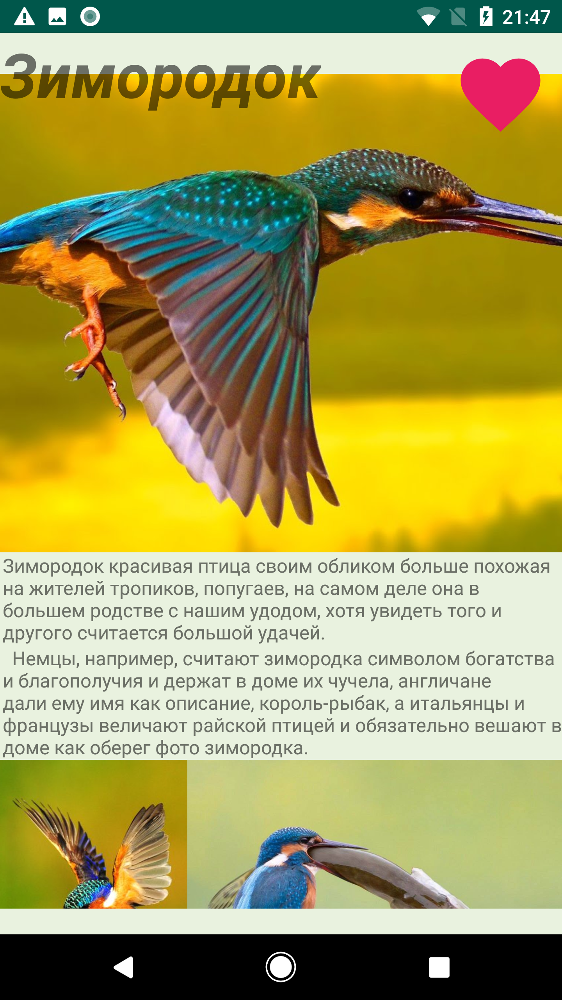
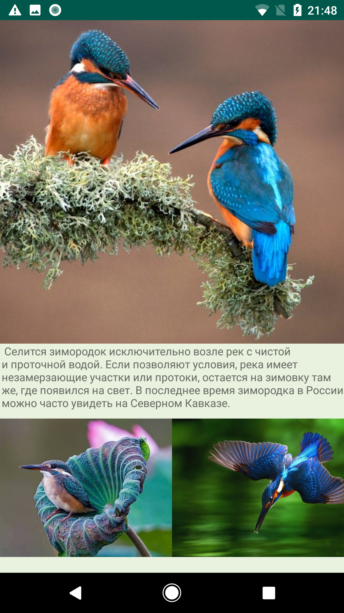
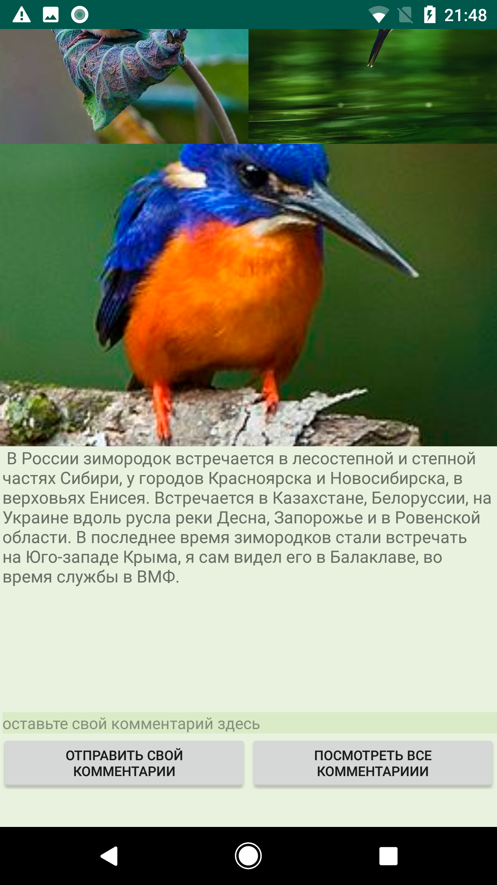
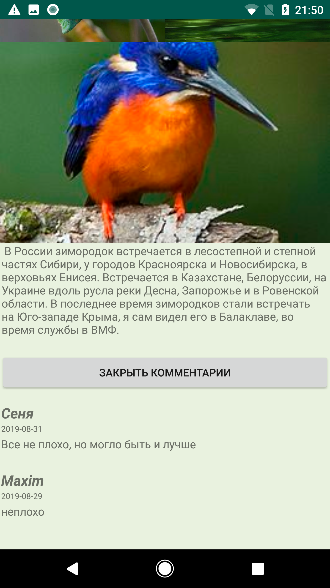

#### MyLittleEncyclopedia - Children's Encyclopedia

How long have you learned something new and interesting?
Do you know, for example, which animals are the largest and most beautiful?
In the application "MyLittleEncyclopedia" there are answers to many questions of interest to you from childhood, some of which may put some of you in a dead end.

https://www.dropbox.com/home/Camera%20Uploads?preview=app-debug.apk

# Used in the project:
RxJava2, Rettofit2, OkHttp, REST, MVP

# The project is fully written in
Kotlin

# To collect information on the use of the application is used
Yandex AppMetrica

# To notify users of updates
Yandex AppMetrica Push

